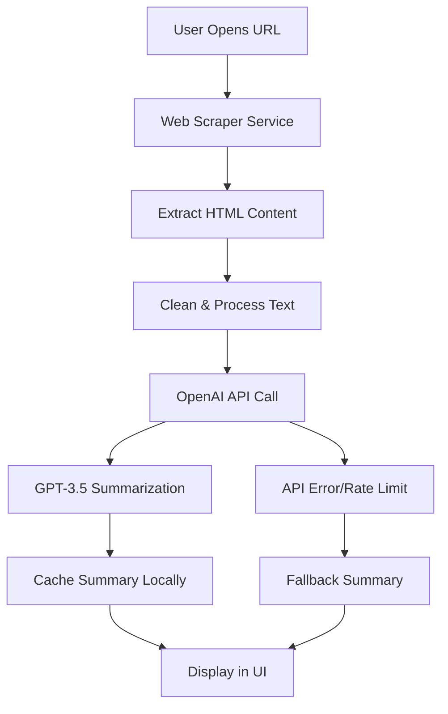
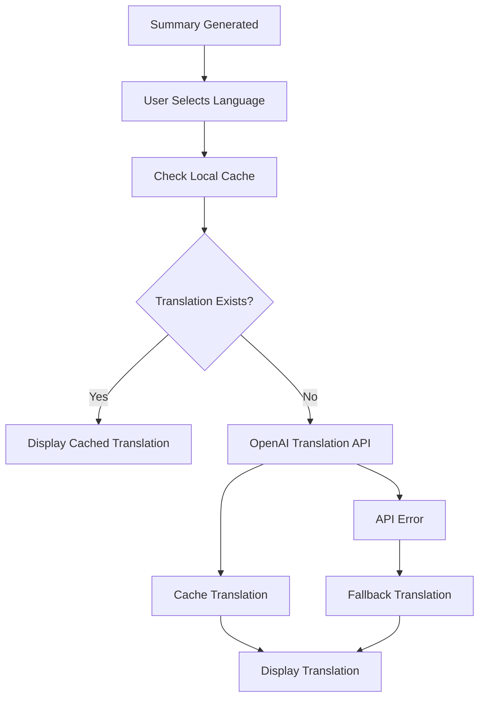

# AI Browser - Advanced AI-Powered Browser & Smart Search Engine

A comprehensive Flutter application that combines intelligent web browsing with AI-powered content analysis, smart search capabilities, and advanced file management features.

## Project Overview

AI Browser is a cross-platform application built with Flutter that provides:

- **Intelligent Web Browsing** with full navigation controls and WebView integration
- **Smart Search Engine** - Detects URLs vs text queries automatically
- **AI-Powered Content Summarization** using OpenAI GPT-3.5 with comprehensive analysis
- **Multi-Language Translation** (Hindi, Spanish, French) with caching
- **Advanced File Management** with PDF creation, download tracking, and content viewing
- **Interactive Downloads Panel** with file opening and content display
- **Dark/Light Theme Support** with complete UI adaptation
- **Browsing History & Multi-Tab Management** with persistent storage
- **Cross-Platform Support** (Android, iOS, Web) with platform-specific optimizations

## Architecture

The application follows **Clean Architecture** principles with clear separation of concerns:

```
lib/
├── main.dart                    # Application entry point
└── app/
    ├── models/                  # Data Models Layer
    │   ├── browser_tab.dart     # Tab data structure
    │   └── file_item.dart       # File metadata model
    ├── services/                # Business Logic Layer
    │   ├── ai_service.dart      # OpenAI integration
    │   ├── storage_service.dart # Local data persistence
    │   ├── web_scraper_service.dart # Content extraction
    │   ├── theme_service.dart   # UI theme management
    │   └── performance_service.dart # App performance monitoring
    ├── modules/                 # Presentation Layer
    │   ├── browser/            # Web browsing module
    │   ├── files/              # File management module
    │   ├── tabs/               # History & tab management
    │   ├── settings/           # App configuration
    │   └── home/               # Main navigation
    └── routes/                 # Navigation routing
        ├── app_routes.dart
        └── app_pages.dart
```

### Architecture Layers:

1. **Presentation Layer** (`modules/`): UI components, controllers, and user interactions
2. **Business Logic Layer** (`services/`): Core application logic and external integrations
3. **Data Layer** (`models/`): Data structures and local storage management

## Setup & Installation

### Prerequisites
- Flutter SDK 3.9.2 or higher
- Dart SDK
- Android Studio / VS Code
- Android SDK (for Android builds)
- Chrome browser (for web builds)

### Installation Steps

1. **Clone the repository**
   ```bash
   git clone <repository-url>
   cd ai_browser_app
   ```

2. **Install dependencies**
   ```bash
   flutter pub get
   ```

3. **Generate model files**
   ```bash
   flutter packages pub run build_runner build
   ```

4. **Run the application**

   **For Android:**
   ```bash
   flutter run -d android
   ```

   **For Web:**
   ```bash
   flutter run -d chrome
   ```

   **For iOS (macOS only):**
   ```bash
   flutter run -d ios
   ```

### Build for Production

**Android APK:**
```bash
flutter build apk --release
```

**Web Build:**
```bash
flutter build web --release
```

## State Management & Storage

### State Management: GetX

**Why GetX was chosen:**
- **Reactive Programming**: Automatic UI updates with `.obs` variables
- **Dependency Injection**: Efficient service management with `Get.put()` and `Get.lazyPut()`
- **Route Management**: Simplified navigation with `Get.to()` and `Get.back()`
- **Performance**: Minimal boilerplate and excellent performance
- **Developer Experience**: Easy to learn and implement

**Implementation Example:**
```dart
class BrowserController extends GetxController {
  var tabs = <BrowserTab>[].obs;  // Reactive list
  var isLoading = false.obs;      // Reactive boolean
  
  void addTab(String url) {
    tabs.add(BrowserTab(url: url));  // Automatic UI update
  }
}
```

### Storage Solutions

**Primary: Hive (NoSQL)**
- **Fast Performance**: Optimized for mobile devices
- **Type Safety**: Code generation with adapters
- **Cross-Platform**: Works on all Flutter platforms
- **Offline Support**: Local storage without external dependencies

**Secondary: SQLite (Relational)**
- **Complex Queries**: Advanced data relationships
- **Scalability**: Better for large datasets
- **SQL Support**: Familiar query language

**Storage Implementation:**
```dart
// Hive Model
@HiveType(typeId: 0)
class BrowserTab extends HiveObject {
  @HiveField(0) String id;
  @HiveField(1) String title;
  @HiveField(2) String url;
}

// Storage Service
class StorageService extends GetxService {
  late Box<BrowserTab> _tabsBox;
  
  Future<void> saveTabs(List<BrowserTab> tabs) async {
    await _tabsBox.clear();
    for (var tab in tabs) {
      await _tabsBox.put(tab.id, tab);
    }
  }
}
```

## AI Integration Flow

### Summarization Process



### Translation Workflow



### API Implementation

**Summarization Service:**
```dart
Future<Map<String, dynamic>> summarizeText(String text) async {
  try {
    final response = await _dio.post(
      'https://api.openai.com/v1/chat/completions',
      options: Options(headers: {
        'Authorization': 'Bearer $_apiKey',
        'Content-Type': 'application/json',
      }),
      data: {
        'model': 'gpt-3.5-turbo',
        'messages': [
          {
            'role': 'system',
            'content': 'You are an expert content summarizer...'
          },
          {
            'role': 'user',
            'content': 'Summarize this content: $text'
          }
        ],
        'max_tokens': 1500,
        'temperature': 0.5,
      },
    );
    
    return {
      'summary': response.data['choices'][0]['message']['content'],
      'originalWordCount': text.split(' ').length,
    };
  } catch (e) {
    // Fallback to local summary generation
    return _generateFallbackSummary(text);
  }
}
```

## Features

### Core Modules

1. **Smart Browser Module**
   - Multi-tab browsing with advanced WebView integration
   - Intelligent URL detection vs text search queries
   - Navigation controls (back, forward, refresh) with history management
   - Real-time loading states and error handling
   - External browser fallback for blocked sites

2. **AI-Powered Search Engine**
   - Automatic detection of URLs vs search queries
   - AI-generated responses for text searches
   - Web browsing for URL inputs
   - Platform-specific API handling (mobile vs web)
   - Comprehensive search result formatting

3. **Advanced AI Summary Module**
   - Real-time content extraction from web pages
   - OpenAI GPT-3.5 integration with detailed analysis
   - Intelligent fallback summaries with comprehensive content
   - Copy, share, and PDF export options
   - Right-side panel display with smooth animations

4. **Multi-Language Translation System**
   - Support for Hindi, Spanish, French translations
   - Cached translations for offline access
   - Real-time language switching in summary panel
   - Translation progress indicators
   - Fallback translation support

5. **Enhanced File Management**
   - PDF creation with formatted content and metadata
   - File download tracking with timestamps
   - Interactive file opening and content viewing
   - File content display in browser panel
   - Automatic cleanup of broken file references
   - Copy file content functionality

6. **Advanced Downloads System**
   - Modern dropdown design with file icons
   - Chronological sorting (latest first)
   - File size and date formatting
   - One-tap file opening
   - Content preview and copying
   - Automatic file cleanup

7. **Comprehensive Theme System**
   - Complete dark/light mode support
   - Dynamic color adaptation for all UI elements
   - Theme-aware text colors and backgrounds
   - Smooth theme transitions
   - Persistent theme preferences

8. **Multi-Tab Management**
   - Visual tab indicators with active states
   - Tab switching with smooth animations
   - Tab closing with confirmation
   - Persistent tab state across sessions
   - Tab title and URL management

## Technical Specifications

- **Framework**: Flutter 3.9.2+
- **Language**: Dart
- **State Management**: GetX 4.6.6 (Reactive programming with .obs)
- **Storage**: Hive 2.2.3 (Primary NoSQL) + SQLite 2.3.3 (Relational backup)
- **HTTP Client**: Dio 5.3.2 with error handling and retries
- **AI Integration**: OpenAI GPT-3.5 API with fallback responses
- **WebView**: flutter_inappwebview 6.1.5 with advanced settings
- **File Operations**: file_picker 8.1.2 + open_file 3.3.2
- **PDF Generation**: syncfusion_flutter_pdf 20.4.54
- **Platform Detection**: flutter/foundation.dart for web/mobile optimization

## Performance Features

- **FPS Monitoring**: Real-time performance tracking with visual indicators
- **Lazy Loading**: Efficient memory management for large content
- **Smart Caching Strategy**: 
  - File content caching for instant access
  - Translation caching for offline use
  - Tab state persistence
  - Global file content storage
- **Platform Optimization**:
  - Web-specific CORS handling
  - Mobile-optimized API calls
  - Conditional feature loading
- **Advanced Error Handling**:
  - Graceful API failure recovery
  - Automatic file cleanup
  - Network error management
  - User-friendly error messages
- **Memory Management**:
  - Efficient WebView handling
  - Automatic resource cleanup
  - Optimized state management

## Latest Features (v2.0)

### 🆕 Smart Search Engine
- **Intelligent Query Detection**: Automatically distinguishes between URLs and search queries
- **AI-Powered Responses**: Generates comprehensive answers for text searches
- **Seamless Web Browsing**: Direct navigation for URL inputs
- **Platform-Aware Processing**: Optimized for both web and mobile platforms

### 🎨 Enhanced UI/UX
- **Complete Dark Mode**: Full theme support with proper contrast and visibility
- **Modern Downloads Panel**: Clean design with file icons and metadata
- **Smooth Animations**: Fluid transitions and loading states
- **Responsive Design**: Optimized for different screen sizes

### 📁 Advanced File System
- **Interactive File Opening**: Tap to view file content in browser panel
- **Content Display**: Full file content viewing with copy functionality
- **Smart File Management**: Automatic cleanup of broken references
- **PDF Creation**: Generate formatted PDFs with metadata

### 🔧 Technical Improvements
- **Error Recovery**: Graceful handling of API failures and network issues
- **Performance Optimization**: Efficient memory usage and faster loading
- **Cross-Platform Compatibility**: Seamless experience across all platforms
- **State Persistence**: Reliable data storage and retrieval

## Developer

**Atul Kumawat** - Senior Flutter Developer

This project demonstrates advanced Flutter development expertise including:
- **Cross-Platform Development**: Unified codebase for Android, iOS, and Web
- **AI Integration**: Advanced OpenAI GPT-3.5 implementation with error handling
- **Clean Architecture**: Modular, maintainable, and scalable code structure
- **Advanced State Management**: Reactive programming with GetX
- **Performance Engineering**: Real-time optimization and monitoring
- **UI/UX Excellence**: Modern design with smooth animations and transitions
- **Platform-Specific Optimization**: Tailored solutions for different platforms

## Usage Instructions

### Smart Search
1. **For Web Browsing**: Enter URLs like `google.com`, `facebook.com`, `wikipedia.org`
2. **For AI Search**: Enter questions like `"what is artificial intelligence?"`, `"how to code?"`
3. **Auto-Detection**: The app automatically determines your intent

### File Management
1. **Download Files**: Use the PDF export feature from AI summaries
2. **View Files**: Tap on files in the downloads dropdown to view content
3. **Copy Content**: Use the copy button when viewing file content
4. **File Cleanup**: Broken files are automatically removed

### AI Features
1. **Generate Summaries**: Click "AI Summary" button on any webpage
2. **Translate Content**: Use the language dropdown in the summary panel
3. **Export Content**: Download summaries as formatted PDF files
4. **Copy & Share**: Use built-in sharing options

### Theme & Customization
1. **Toggle Theme**: Use the palette icon in the app bar
2. **Persistent Settings**: Your preferences are automatically saved
3. **Adaptive UI**: All elements adapt to your chosen theme

## License

This project is developed as a comprehensive Flutter development showcase demonstrating:
- Advanced mobile app development with AI integration
- Cross-platform compatibility and optimization
- Modern UI/UX design principles
- Performance engineering and optimization
- Clean architecture and best practices

---

**Created by Atul Kumawat | Senior Flutter Developer | Powered by OpenAI GPT-3.5 Technology**

*Showcasing the future of intelligent mobile browsing with AI-powered content analysis and smart search capabilities.*