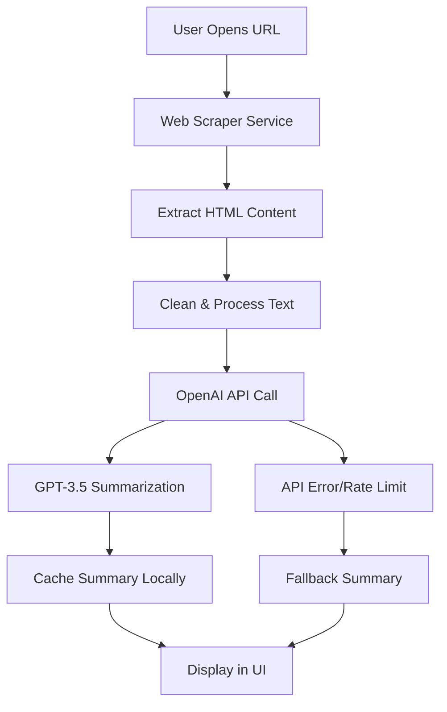
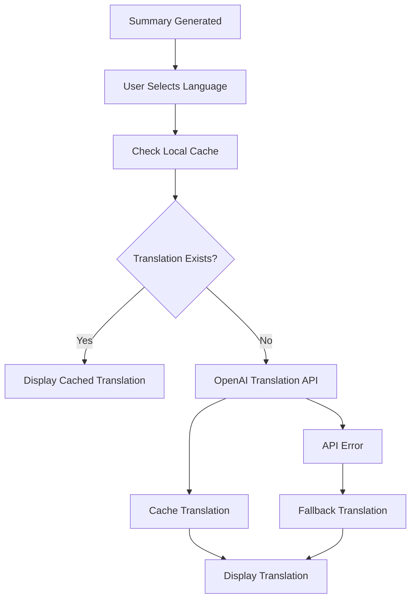

# AI Browser - AI-Powered In-App Browser & Document Summarizer

A comprehensive Flutter application that combines web browsing capabilities with AI-powered content summarization and multi-language translation features.

## Project Overview

AI Browser is a cross-platform mobile application built with Flutter that provides:

- **In-App Web Browsing** with full navigation controls
- **AI-Powered Content Summarization** using OpenAI GPT-3.5
- **Multi-Language Translation** (Hindi, Spanish, French)
- **File Management System** with document processing
- **Browsing History & Tab Management**
- **Offline Content Access** with local caching
- **Cross-Platform Support** (Android, iOS, Web)

## Architecture

The application follows **Clean Architecture** principles with clear separation of concerns:

```
lib/
├── main.dart                    # Application entry point
└── app/
    ├── models/                  # Data Models Layer
    │   ├── browser_tab.dart     # Tab data structure
    │   └── file_item.dart       # File metadata model
    ├── services/                # Business Logic Layer
    │   ├── ai_service.dart      # OpenAI integration
    │   ├── storage_service.dart # Local data persistence
    │   ├── web_scraper_service.dart # Content extraction
    │   ├── theme_service.dart   # UI theme management
    │   └── performance_service.dart # App performance monitoring
    ├── modules/                 # Presentation Layer
    │   ├── browser/            # Web browsing module
    │   ├── files/              # File management module
    │   ├── tabs/               # History & tab management
    │   ├── settings/           # App configuration
    │   └── home/               # Main navigation
    └── routes/                 # Navigation routing
        ├── app_routes.dart
        └── app_pages.dart
```

### Architecture Layers:

1. **Presentation Layer** (`modules/`): UI components, controllers, and user interactions
2. **Business Logic Layer** (`services/`): Core application logic and external integrations
3. **Data Layer** (`models/`): Data structures and local storage management

## Setup & Installation

### Prerequisites
- Flutter SDK 3.9.2 or higher
- Dart SDK
- Android Studio / VS Code
- Android SDK (for Android builds)
- Chrome browser (for web builds)

### Installation Steps

1. **Clone the repository**
   ```bash
   git clone <repository-url>
   cd ai_browser_app
   ```

2. **Install dependencies**
   ```bash
   flutter pub get
   ```

3. **Generate model files**
   ```bash
   flutter packages pub run build_runner build
   ```

4. **Run the application**

   **For Android:**
   ```bash
   flutter run -d android
   ```

   **For Web:**
   ```bash
   flutter run -d chrome
   ```

   **For iOS (macOS only):**
   ```bash
   flutter run -d ios
   ```

### Build for Production

**Android APK:**
```bash
flutter build apk --release
```

**Web Build:**
```bash
flutter build web --release
```

## State Management & Storage

### State Management: GetX

**Why GetX was chosen:**
- **Reactive Programming**: Automatic UI updates with `.obs` variables
- **Dependency Injection**: Efficient service management with `Get.put()` and `Get.lazyPut()`
- **Route Management**: Simplified navigation with `Get.to()` and `Get.back()`
- **Performance**: Minimal boilerplate and excellent performance
- **Developer Experience**: Easy to learn and implement

**Implementation Example:**
```dart
class BrowserController extends GetxController {
  var tabs = <BrowserTab>[].obs;  // Reactive list
  var isLoading = false.obs;      // Reactive boolean
  
  void addTab(String url) {
    tabs.add(BrowserTab(url: url));  // Automatic UI update
  }
}
```

### Storage Solutions

**Primary: Hive (NoSQL)**
- **Fast Performance**: Optimized for mobile devices
- **Type Safety**: Code generation with adapters
- **Cross-Platform**: Works on all Flutter platforms
- **Offline Support**: Local storage without external dependencies

**Secondary: SQLite (Relational)**
- **Complex Queries**: Advanced data relationships
- **Scalability**: Better for large datasets
- **SQL Support**: Familiar query language

**Storage Implementation:**
```dart
// Hive Model
@HiveType(typeId: 0)
class BrowserTab extends HiveObject {
  @HiveField(0) String id;
  @HiveField(1) String title;
  @HiveField(2) String url;
}

// Storage Service
class StorageService extends GetxService {
  late Box<BrowserTab> _tabsBox;
  
  Future<void> saveTabs(List<BrowserTab> tabs) async {
    await _tabsBox.clear();
    for (var tab in tabs) {
      await _tabsBox.put(tab.id, tab);
    }
  }
}
```

## AI Integration Flow

### Summarization Process



### Translation Workflow



### API Implementation

**Summarization Service:**
```dart
Future<Map<String, dynamic>> summarizeText(String text) async {
  try {
    final response = await _dio.post(
      'https://api.openai.com/v1/chat/completions',
      options: Options(headers: {
        'Authorization': 'Bearer $_apiKey',
        'Content-Type': 'application/json',
      }),
      data: {
        'model': 'gpt-3.5-turbo',
        'messages': [
          {
            'role': 'system',
            'content': 'You are an expert content summarizer...'
          },
          {
            'role': 'user',
            'content': 'Summarize this content: $text'
          }
        ],
        'max_tokens': 1500,
        'temperature': 0.5,
      },
    );
    
    return {
      'summary': response.data['choices'][0]['message']['content'],
      'originalWordCount': text.split(' ').length,
    };
  } catch (e) {
    // Fallback to local summary generation
    return _generateFallbackSummary(text);
  }
}
```

## Features

### Core Modules

1. **Browser Module**
   - Multi-tab browsing with WebView
   - Navigation controls (back, forward, refresh)
   - URL validation and handling
   - Download support for documents

2. **AI Summary Module**
   - Real-time content extraction
   - OpenAI GPT-3.5 integration
   - Intelligent fallback summaries
   - Copy, share, and export options

3. **Translation Module**
   - Multi-language support (Hindi, Spanish, French)
   - Cached translations for offline access
   - Real-time language switching

4. **File Management**
   - Document upload and processing
   - PDF, DOCX, PPTX, XLSX support
   - File summarization and translation
   - Local storage management

5. **History & Tabs**
   - Browsing history tracking
   - Active tab management
   - Visit count and timestamps
   - Search and filter capabilities

6. **Settings & Preferences**
   - Dark/Light theme toggle
   - AI feature controls
   - Privacy settings
   - Cache management

## Technical Specifications

- **Framework**: Flutter 3.9.2+
- **Language**: Dart
- **State Management**: GetX 4.6.6
- **Storage**: Hive 2.2.3 + SQLite 2.3.3
- **HTTP Client**: Dio 5.3.2
- **AI Integration**: OpenAI API
- **WebView**: flutter_inappwebview 6.1.5
- **File Operations**: file_picker 8.1.2

## Performance Features

- **FPS Monitoring**: Real-time performance tracking
- **Lazy Loading**: Efficient memory management
- **Caching Strategy**: Intelligent content caching
- **Offline Support**: Local data persistence
- **Error Handling**: Comprehensive error management

## Developer

**Atul Kumawat** - Flutter Developer

This project showcases advanced Flutter development skills including:
- Cross-platform mobile app development
- AI integration with OpenAI GPT-3.5
- Clean Architecture implementation
- State management with GetX
- Real-time performance optimization

## License

This project is developed as part of a Flutter development assignment demonstrating advanced mobile app development skills with AI integration.

---

**Created by Atul Kumawat | Flutter Developer | Powered by OpenAI Technology**